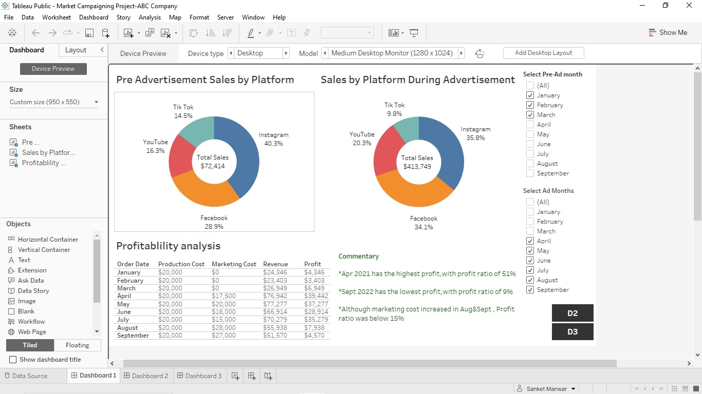
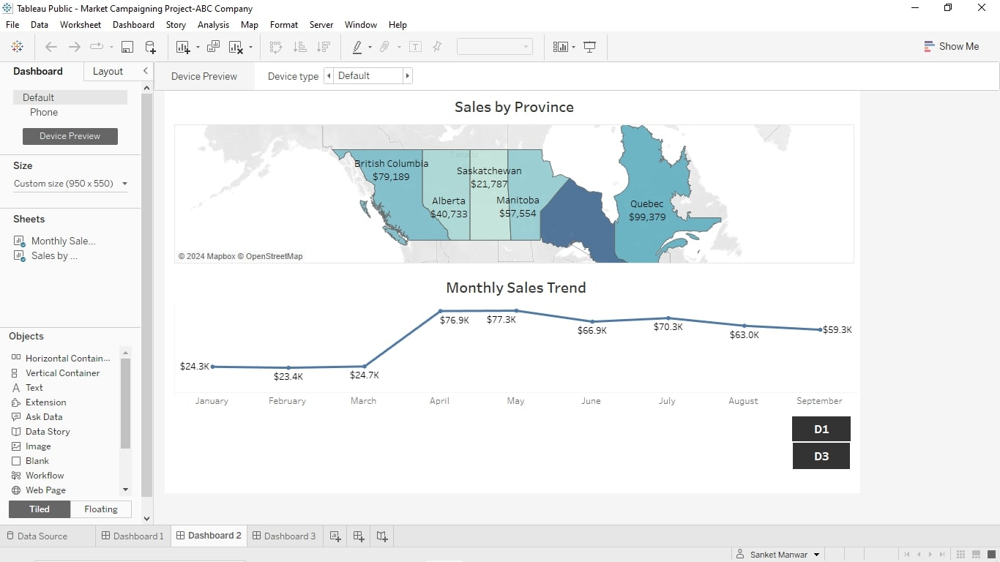
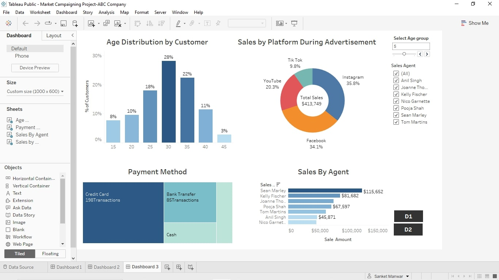

# ABC Company Marketing Campaign

- In January of 2021, ABC company launched a new product line and started creating awareness about the products on YouTube, Facebook, Tik Tok and Instagram.
- Although ABC company made sales across all platforms, the marketing department suggests that sales would increase if ABC Company use paid advertisements on all 4 platforms.
- On April 1st, 2021, ABC company started using paid advertisements which led to increase in sales.
- It's now 6 months since the paid advertisement started. ABC company would like a detail analysis of sales performance before and after the paid advertisements.

## Below are the performance metrics needed.
---
1. Total Sales on social media platform before paid advertisement
2. Total Sales on social media platform during paid advertisement
3. Profitability analysis
4. Sales by location
5. Sales trend
6. Customers demographic
7.  Transaction methods
8.  Sales by agents

## Dashboards
### D1               
        
### D2               
     
###  D3               
      

## Findings
1. April 2021 has the highest profit, with profit ratio of 51%.
2. September 2022 has the lowest profit,with profit ratio of 9%.
3. Although marketing cost increased in AUgust & September , Profit ratio was below 15%.

  
