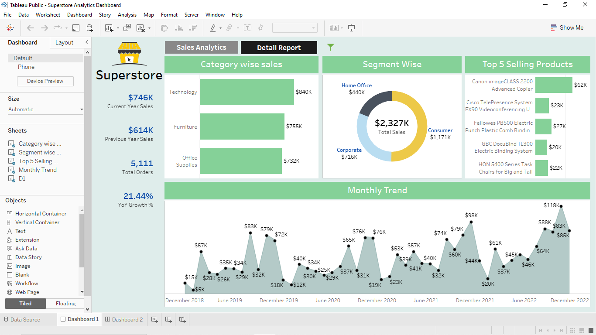
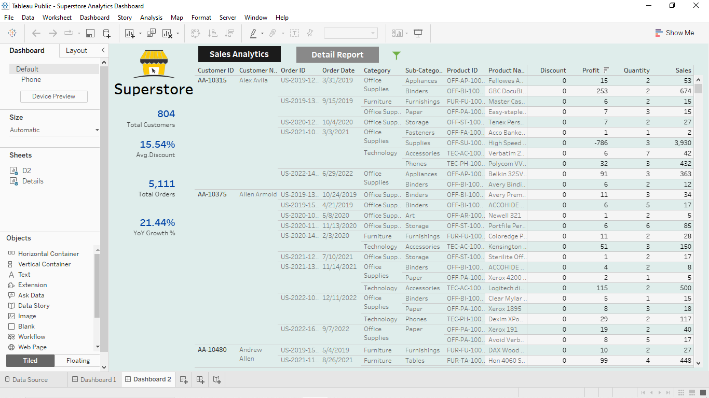
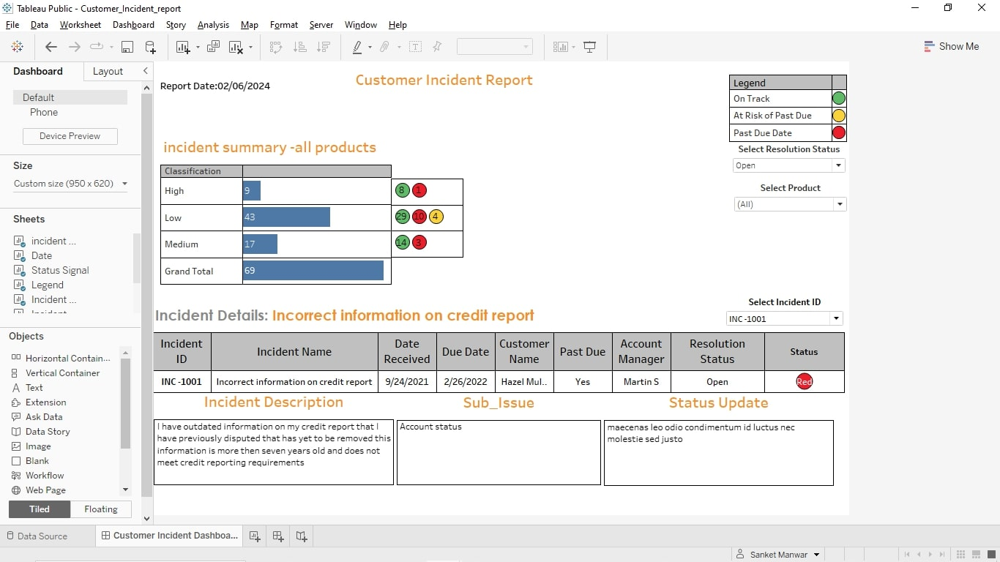

# Tableau Dashboards

## Table of contents
- [ABC Company Marketing Campaign](#abc-company-marketing-campaign)
- [ Superstore Data Analytics](#superstore-data-analytics)
- [Customer Incident Report](#customer-incident-report)

## ABC Company Marketing Campaign
---

- In January of 2021, ABC company launched a new product line and started creating awareness about the products on YouTube, Facebook, Tik Tok and Instagram.
- Although ABC company made sales across all platforms, the marketing department suggests that sales would increase if ABC Company use paid advertisements on all 4 platforms.
- On April 1st, 2021, ABC company started using paid advertisements which led to increase in sales.
- It's now 6 months since the paid advertisement started. ABC company would like a detail analysis of sales performance before and after the paid advertisements.

### Below are the performance metrics needed.
---
1. Total Sales on social media platform before paid advertisement
2. Total Sales on social media platform during paid advertisement
3. Profitability analysis
4. Sales by location
5. Sales trend
6. Customers demographic
7.  Transaction methods
8.  Sales by agents
#### You can Access the file:
- File
   - [View_Here](https://public.tableau.com/app/profile/sanket.manwar/viz/MarketCampaigningProject-ABCCompany/Dashboard1?publish=yes)

### Dashboards
---
### D1               
        
### D2               
     
###  D3               
      

### Findings
---
1. April 2021 has the highest profit, with profit ratio of 51%.
2. September 2022 has the lowest profit,with profit ratio of 9%.
3. Although marketing cost increased in August & September , Profit ratio was below 15%.

##  Superstore Data Analytics
---

#### Create a dashboard on Superstore Analytics as shown in below figures. The formatting / labelling / spacing / alignment should be the same as used in the charts. 
---

- 	The worksheet titles, KPI titles represent which dimensions/measures are required in respective places.
- 	Make sure to use New Order Date in place of existing Order Date dimension for doing any date calculations or adding the Year filter on top.
- 	Add appropriate tooltips everywhere.
- 	Add the Year(New Order Date), Region and Category filters on top. All filters must be in multiple values dropdown mode. These filters should be applied to all the worksheets used in dashboard 1 and dashboard 2. Make sure Year filter should not be applied to current year sales, previous year sales and YoY growth % as these values are for current year and previous year. Make sure to apply filters on table in dashboard 2.
- 	Initially filters are in hidden state. If you click on show filters icon the filters need to open. When you click on hide filters icon the filters should hide back.
- 	Apply filter actions keeping bar chart, donut chart and Top 5 bar chart as source and all the worksheets as target.
- 	Make sure to show top 5 products w.r.t. sum of sales every time irrespective of any filter action values you select or any dropdown filter values you select.
- 	On the click of Detail Report tab, the dashboard 2 should open and on the click of Sales Analytics tab, dashboard 1 should open. Use appropriate tooltips.

#### You can Access the file:
---
- File
   - [View_Here](https://public.tableau.com/app/profile/sanket.manwar/viz/SuperstoreAnalyticsDashboard_17072159025010/Dashboard1?publish=yes)

Sales Analytics         |  Detail Report
:----------------------:|:-----------------------:
  | 

##  Customer Incident Report
---

- You just got a position as a Business Intelligence Developer at a financial institution.
- Your team is responsible for opening tickets regarding customer incidents on different products and services.
#### Your task is to create a dashboard showing:
#### Summary of all cases:
---
   - Total number of incidents
   - Incident Classification (Low,Medium,High)
   - Status signal of incidents (Green,Yellow,Red)

#### Individual Incident Details:
---
   Incident ID, Incident name, Incident description, Sub issue, Status update, Date received, Due date, Customer name, Past due status, Account manager, Resolution status.

#### You can Access the file:
---
- File
   - [View_Here](https://public.tableau.com/app/profile/sanket.manwar/viz/Customer_Incident_report/CustomerIncidentDashboard?publish=yes)

## Dashboard

   

